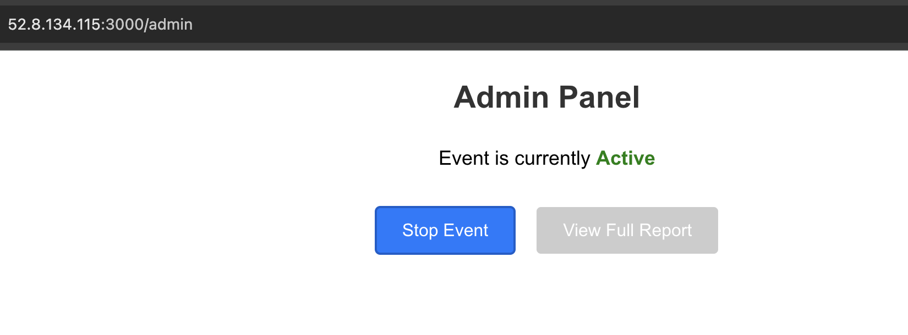
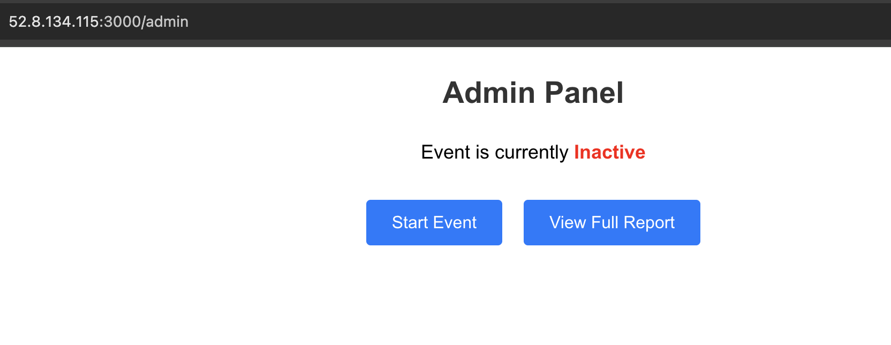
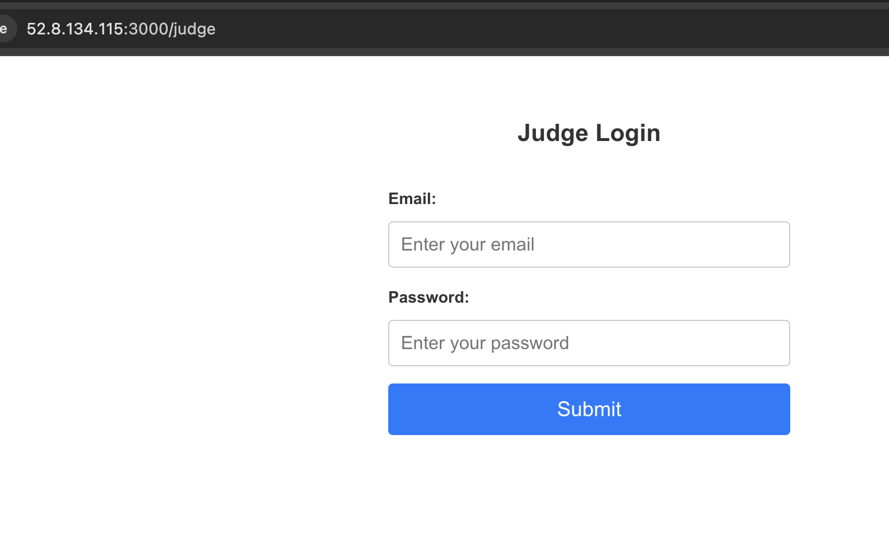
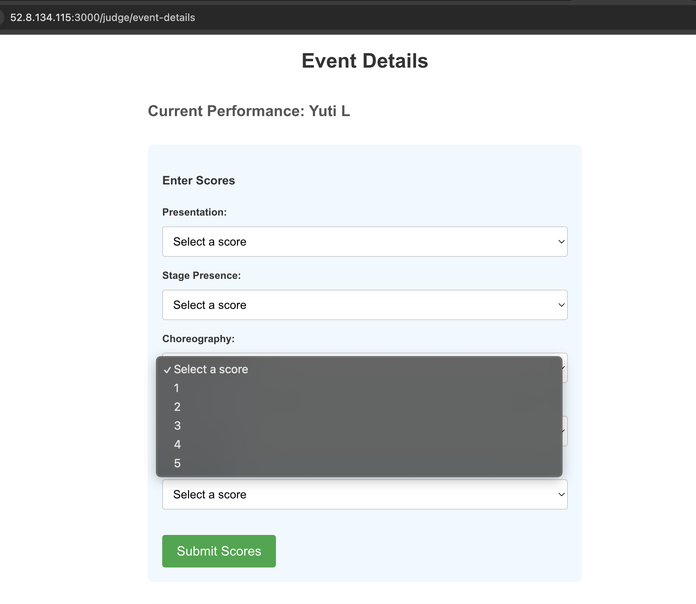
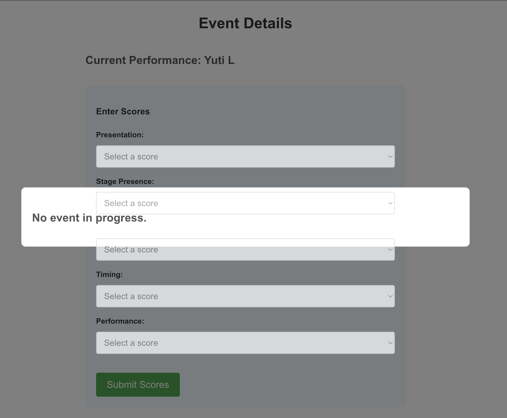
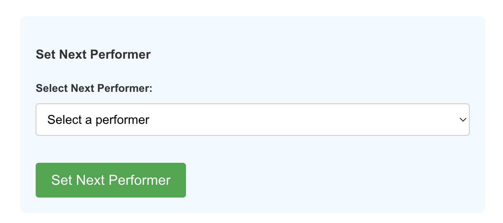
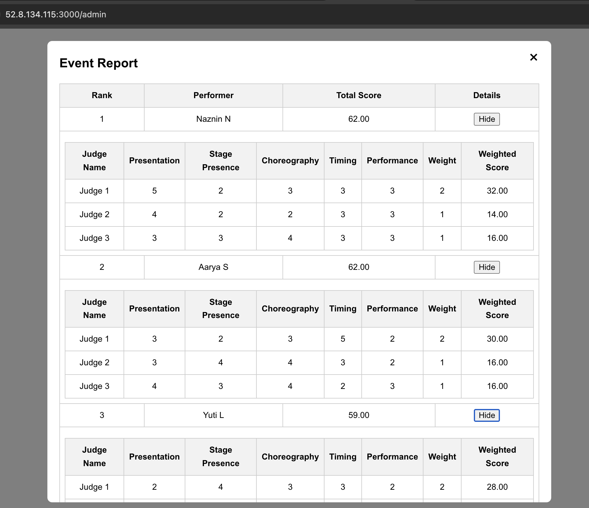

# JudgeWise - Intelligent Performance Scoring System

The Score Board Application is a web-based platform designed to facilitate scoring and ranking in competitive events. It allows judges to submit scores for performers, provides an admin interface for event management, and offers a real-time view for bystanders to monitor the scoring progress.

## Overview

This application is built using a client-server architecture:
- **Backend**: A Flask application serving RESTful APIs.
- **Frontend**: A React.js application providing interactive user interfaces.
- **Database**: MySQL database storing all the event data.


## Setup Instructions

Ensure that your `docker-compose.yml` file is correctly configured with the correct IP address of EC2 instance for the database connection and API base URL.

Use Docker Compose to build and run the application:

This will start the backend Flask server and the frontend React application.
```bash
docker-compose up --build
```

## Prerequisites

Running EC2 instance in AWS. 
For demo, I had a running instance with IP address `52.8.134.115`. 

## Docker Commands

Login to EC2 instance and run these commands.

- **Start the Application**: 
  ```bash
  docker-compose up
  ```

- **Stop the Application**: 
  ```bash
  docker-compose down
  ```

- **Rebuild the Application**: 
  ```bash
  docker-compose up --build
  ```

- **View Logs**: 
  ```bash
  docker-compose logs
  ```

### Access the Application

- **Frontend**: Open your browser and navigate to `52.8.134.115:3000` to access the frontend application.

## Endpoints:
- Admin view : `52.8.134.115:3000/admin`
- Judge login : `52.8.134.115:3000/judge`
- Bystander view : `52.8.134.115:3000/bystander`

### Demo instance

#### Admin page




#### Judge login page



#### Judge scoring page



#### Judge page till he waits for his turn
Note: This is to enable the sequential mode of scoring among judges



#### Select next performer



#### View full report 



